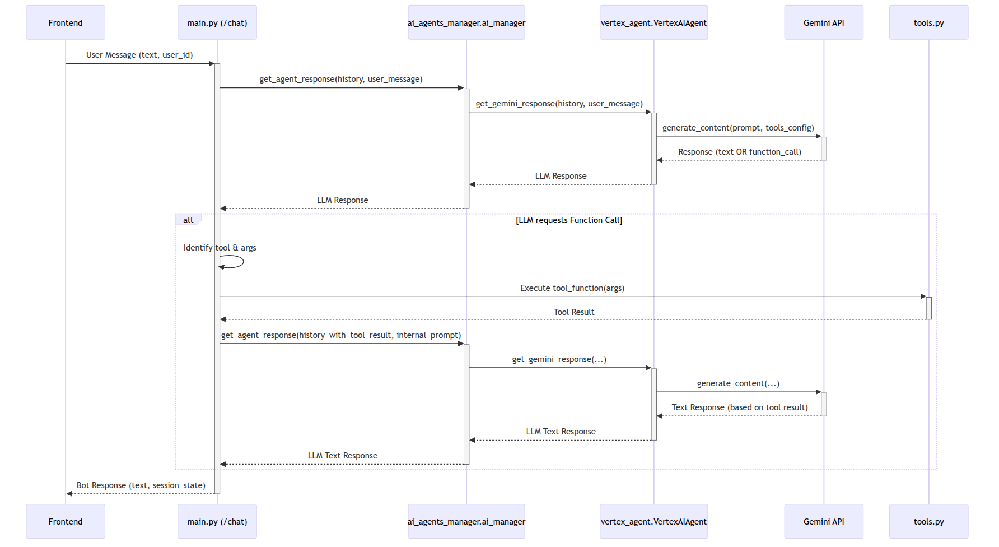

# Tài Liệu Thiết Kế: Chatbot AI Vexere (Kiến trúc Mục tiêu & POC)

## 1. Giới Thiệu và Mục Tiêu

Tài liệu này phác thảo thiết kế cho Chatbot AI của Vexere, bao gồm cả kiến trúc mục tiêu cho một hệ thống sản xuất và việc triển khai Proof of Concept (POC) hiện tại. Mục tiêu chính là:

- **Kiến trúc Mục tiêu:** Mô tả một hệ thống chatbot AI mạnh mẽ, có khả năng mở rộng, bảo mật và dễ bảo trì.
- **POC:** Chứng minh tính khả thi của các thành phần cốt lõi, bao gồm:
  - Cung cấp câu trả lời FAQ (sử dụng RAG).
  - Hỗ trợ quy trình sau dịch vụ (thay đổi đặt vé).
  - Nền tảng cho xử lý đa phương thức.

## 2. Kiến trúc tổng quan (Kiến trúc Mục tiêu)

Kiến trúc mục tiêu của hệ thống Chatbot AI Vexere được thiết kế theo hướng module hóa, khả năng mở rộng và bảo trì cao, dựa trên các microservices hoặc các module được tách biệt rõ ràng.

- **Frontend Channels:** Giao diện người dùng đa kênh (Web, Mobile App, Zalo, Facebook Messenger, Voice Gateway).
- **API Gateway:** Điểm vào duy nhất cho tất cả các yêu cầu từ frontend, xử lý xác thực, giới hạn tốc độ (rate limiting), và định tuyến.
- **Chatbot Service (Backend Core):**
  - **Orchestration Layer:** Điều phối luồng hội thoại, quản lý trạng thái, gọi các dịch vụ nội bộ và LLM.
  - **Conversation Management Service:** Chịu trách nhiệm lưu trữ và truy xuất lịch sử hội thoại, quản lý trạng thái phiên người dùng một cách bền vững (ví dụ: sử dụng Redis cho trạng thái phiên, PostgreSQL/NoSQL cho lịch sử chi tiết).
  - **Agent Management Service:** Quản lý và tương tác với các LLM provider (ví dụ: Vertex AI Gemini). Bao gồm logic để định dạng prompt, xử lý response, và quản lý tool calling.
  - **Tool Execution Service:** Thực thi các công cụ (functions) được LLM yêu cầu. Các công cụ này có thể tương tác với các dịch vụ nội bộ khác hoặc các API bên ngoài.
  - **RAG Service:** Chịu trách nhiệm cho Retrieval Augmented Generation. Bao gồm:
    - Vector Database (ví dụ: Pinecone, Weaviate, Vertex AI Vector Search).
    - Quy trình embedding tài liệu kiến thức và câu hỏi người dùng.
    - Logic tìm kiếm tương đồng ngữ nghĩa.
- **Vexere Core Services (Internal APIs):** Các API nội bộ của Vexere cung cấp chức năng nghiệp vụ (ví dụ: quản lý đặt vé, thông tin chuyến đi, xử lý thanh toán). Chatbot sẽ tương tác với các API này thông qua Tool Execution Service.
- **LLM Provider:** Google Vertex AI (Gemini 2.5 Pro Preview `gemini-2.5-pro-preview-05-06` hoặc các model tương đương/mới hơn).
- **Logging & Monitoring Service:** Hệ thống tập trung để thu thập log, theo dõi hiệu suất, và cảnh báo.
- **Configuration Service:** Quản lý cấu hình tập trung cho các thành phần khác nhau.

### Sơ đồ Kiến trúc Mục tiêu (Conceptual)

_Tham khảo `target_architecture_diagram.mmd` để xem mã nguồn của sơ đồ này._

### Kiến trúc POC Hiện tại và Luồng Dữ liệu

POC hiện tại triển khai một phiên bản đơn giản hóa của kiến trúc trên, chủ yếu tập trung vào một backend FastAPI duy nhất.

_Tham khảo `backend_flow_diagram.mmd` để xem mã nguồn của sơ đồ này._
_Ghi chú: Sơ đồ này mô tả luồng trong POC hiện tại._

## 3. Lựa chọn công nghệ / framework (Cho Kiến trúc Mục tiêu & POC)

### 3.1. Backend (Chatbot Service)

- **Ngôn ngữ:** Python
  - **Lý do:** Hệ sinh thái AI/ML mạnh mẽ, thư viện phong phú, cộng đồng lớn, phù hợp cho phát triển nhanh và các tác vụ tính toán của LLM.
- **Web Framework (cho API Endpoint & Orchestration trong POC):** FastAPI
  - **Lý do:** Hiệu suất cao (ASGI), hỗ trợ async, tự động validation dữ liệu với Pydantic, tài liệu API tự động. Trong kiến trúc mục tiêu, các microservices có thể sử dụng FastAPI hoặc các framework phù hợp khác (gRPC cho giao tiếp nội bộ).
- **AI Core (LLM Provider):** Google Vertex AI (Mô hình Gemini 2.5 Pro Preview `gemini-2.5-pro-preview-05-06`)
  - **Lý do:** LLM đa phương thức tiên tiến, khả năng function calling mạnh mẽ, dịch vụ được quản lý, tích hợp tốt với Google Cloud.
- **Quản lý Trạng thái Phiên (Kiến trúc Mục tiêu):** Redis
  - **Lý do:** Kho lưu trữ key-value trong bộ nhớ, tốc độ cao, phù hợp cho việc lưu trữ và truy xuất nhanh trạng thái phiên.
- **Lưu trữ Lịch sử Hội thoại (Kiến trúc Mục tiêu):** PostgreSQL hoặc NoSQL (ví dụ: MongoDB, Cassandra)
  - **Lý do:** PostgreSQL cho dữ liệu có cấu trúc và ACID, NoSQL cho khả năng mở rộng và linh hoạt với dữ liệu phi cấu trúc/bán cấu trúc của hội thoại.
- **RAG - Vector Database (Kiến trúc Mục tiêu):** Pinecone, Weaviate, Milvus, Vertex AI Vector Search.
  - **Lý do:** Tối ưu hóa cho việc lưu trữ và tìm kiếm tương đồng vector embedding hiệu suất cao.
- **RAG - Embedding Models (Kiến trúc Mục tiêu):** Các mô hình từ Vertex AI (ví dụ: `textembedding-gecko`), Sentence Transformers, hoặc các model embedding mã nguồn mở/thương mại khác.
- **HTTP Client (cho tool-to-API calls trong POC):** `httpx`
  - **Lý do:** Hiện đại, hỗ trợ async.

### 3.2. Frontend Channels

- **Web POC:** HTML, CSS, JavaScript (thuần)
  - **Lý do:** Đơn giản cho POC. Kiến trúc mục tiêu có thể sử dụng các framework hiện đại như React, Vue, Angular cho Web UI.
- **Mobile App, Zalo, Facebook Messenger, Voice Gateway (Kiến trúc Mục tiêu):** Sẽ yêu cầu các SDK và tích hợp đặc thù cho từng nền tảng.

### 3.3. Configuration Management (Kiến trúc Mục tiêu)

- **Công cụ:** HashiCorp Consul, AWS AppConfig, Azure App Configuration, hoặc các biến môi trường được quản lý qua Kubernetes ConfigMaps/Secrets.
- **POC:** Sử dụng file `config.py` và biến môi trường.

## 4. Các sơ đồ thiết kế hệ thống liên quan (Chi tiết cho POC & định hướng Mục tiêu)

### 4.1. Sơ đồ thành phần (POC tập trung)

_Tham khảo `poc_component_diagram.mmd` để xem mã nguồn của sơ đồ này._

_Ghi chú: Sơ đồ này phản ánh kiến trúc của POC hiện tại. Kiến trúc mục tiêu (Mục 2) sẽ có sự phân tách module rõ ràng hơn._

### 4.2. Sơ đồ tuần tự (Luồng Chat trong POC)

## 5. Quy trình kiểm thử & cải tiến liên tục (Định hướng cho Kiến trúc Mục tiêu)

### 5.1. Chiến lược Kiểm thử

- **Kim tự tháp Kiểm thử (Testing Pyramid):**
  - **Unit Tests:** Kiểm thử từng module, class, function một cách độc lập. Mock các dependency bên ngoài (LLM, database, API ngoài).
  - **Integration Tests:** Kiểm thử sự tương tác giữa các module nội bộ (ví dụ: Orchestrator với AgentManager, AgentManager với LLM (có thể mock LLM response), ToolExecutor với RAGService).
  - **Contract Tests:** Đảm bảo các services (ví dụ: Chatbot Service và Vexere Core APIs) tuân thủ hợp đồng API đã định nghĩa (sử dụng Pact hoặc tương tự).
  - **End-to-End (E2E) Tests:** Kiểm thử toàn bộ luồng từ frontend (hoặc API Gateway) đến LLM và các dịch vụ phụ thuộc. Cần cẩn trọng với chi phí và tính ổn định của E2E test liên quan đến LLM.
- **Performance & Load Testing:** Đánh giá khả năng chịu tải và độ trễ của hệ thống.
- **Security Testing:** Quét lỗ hổng, kiểm thử xâm nhập.
- **LLM-Specific Testing:**
  - Đánh giá chất lượng response của LLM (relevance, coherence, hallucination).
  - Kiểm thử robustness của prompt.
  - Kiểm thử tool calling accuracy.

### 5.2. Continuous Improvement / CI/CD Pipeline

- **Source Control:** Git (GitHub, GitLab).
- **CI (Continuous Integration):**
  - Trigger: Mỗi commit/pull request.
  - Steps: Linting, static analysis, unit tests, integration tests, build artifacts (Docker images).
- **CD (Continuous Deployment):**
  - Triển khai tự động lên các môi trường (Dev, Staging, Production) với các approvals phù hợp.
  - Sử dụng các chiến lược triển khai an toàn (Blue/Green, Canary).
- **Infrastructure as Code (IaC):** Sử dụng Terraform, Pulumi, hoặc CloudFormation để quản lý hạ tầng.
- **Monitoring & Observability:**
  - Logging tập trung (ELK, Splunk, CloudWatch Logs).
  - Metrics & Alerting (Prometheus, Grafana, Datadog, CloudWatch Metrics).
  - Distributed Tracing (Jaeger, Zipkin, OpenTelemetry).
  - LLM Observability tools để theo dõi prompts, responses, token usage, costs, performance.

_(Phần kiểm thử của POC hiện tại được mô tả trong CODE_REVIEW.md và README.md)_

## 6. Các hạng mục liên quan khác (Cho Kiến trúc Mục tiêu)

### 6.1. Khả năng Mở rộng (Scalability)

Thiết kế dựa trên microservices hoặc các module độc lập cho phép scaling từng phần riêng biệt. Sử dụng message queues (Kafka, RabbitMQ) cho các tác vụ bất đồng bộ. Database và Vector DB cần được chọn và cấu hình để có khả năng mở rộng.

### 6.2. Bảo mật (Security)

Xác thực/ủy quyền (OAuth2/OIDC, JWT), mã hóa dữ liệu (at rest, in transit), quản lý secrets (Vault, KMS), network security (VPC, firewalls),ป้องกัน tấn công (WAF, rate limiting), tuân thủ quy định (GDPR, etc.).

### 6.3. Xử lý Lỗi và Độ tin cậy (Error Handling & Reliability)

Circuit breakers, retries với exponential backoff, dead-letter queues, idempotency cho các operations quan trọng. Global error handling và logging chi tiết.

### 6.4. Xử lý Đa phương thức (Multimodal Processing)

Kiến trúc mục tiêu sẽ hỗ trợ đầy đủ việc gửi dữ liệu đa phương thức (image, audio, video bytes hoặc GCS URIs) trực tiếp tới Gemini thông qua `Part` objects. Cần có cơ chế lưu trữ và quản lý các media này hiệu quả nếu cần tham chiếu lại trong lịch sử hội thoại dài hạn.

### 6.5. Quản lý Prompt & Tool

Hệ thống quản lý version cho prompt, thử nghiệm A/B cho prompt. Cơ chế đăng ký và quản lý tool linh hoạt.

---

Tài liệu này mô tả kiến trúc mục tiêu và ghi nhận trạng thái POC hiện tại. Nó sẽ được cập nhật khi dự án phát triển.
