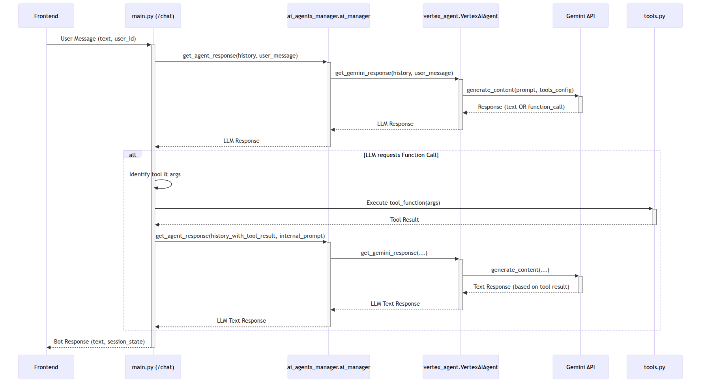

# Chatbot Hỗ Trợ Khách Hàng - Dự án Thử nghiệm (POC)

Dự án này là một Dự án Thử nghiệm (Proof of Concept - POC) cho một Chatbot AI, được thiết kế để khám phá các khả năng tương tác với khách hàng do AI điều khiển.

## Video Demo Dự án

[Xem video demo dự án trên Google Drive](https://drive.google.com/file/d/18DCeBR8PjrrkV49d4PGPJWCods91131I/view?usp=sharing)

## Tài liệu Liên quan

- [Tài liệu Thiết kế (Design Document)](DESIGN_DOCUMENT.md)
- [Đánh giá Code (Code Review)](CODE_REVIEW.md)

## Mục tiêu

POC này nhằm mục đích minh họa:

1.  Một giao diện chat dựa trên văn bản.
2.  Chức năng RAG-FAQ (sử dụng một bộ câu hỏi thường gặp được xác định trước).
3.  Một quy trình Sau Dịch vụ: Thay đổi thời gian đặt vé ("đổi giờ").
4.  Một cấu trúc mã nguồn sẵn sàng để tích hợp xử lý hình ảnh và giọng nói (mặc dù chưa được triển khai chi tiết).
5.  Hướng dẫn cơ bản để chạy và kiểm thử.

## Tech Stack

- **Backend:** Python (FastAPI)
- **AI Core:** Google Vertex AI (Gemini 2.5 Pro Preview - model `gemini-2.5-pro-preview-05-06`)
- **Frontend:** HTML, CSS, JavaScript
- **Dữ liệu FAQ:** Tệp JSON (được sử dụng bởi một công cụ cục bộ do AI gọi)

## Thiết kế Backend và Luồng hoạt động

Backend được xây dựng bằng FastAPI và được cấu trúc thành nhiều module để xử lý các khía cạnh khác nhau của chức năng chatbot.

### Các Module Cốt lõi và Trách nhiệm

| Tệp                        | Trách nhiệm                                                                                                                                                                      | Tương tác chính                                                                                                                                       |
| :------------------------- | :------------------------------------------------------------------------------------------------------------------------------------------------------------------------------- | :---------------------------------------------------------------------------------------------------------------------------------------------------- |
| `app/main.py`              | Ứng dụng FastAPI chính. Định nghĩa các API endpoint (ví dụ: `/chat`), quản lý CORS, điều phối luồng chat, xử lý lịch sử hội thoại và trạng thái công cụ.                         | Imports và sử dụng `ai_manager` (từ `ai_agents_manager.py`), các hàm trong `tools.py`, và các schema Pydantic trong `models.py`.                      |
| `app/ai_agents_manager.py` | Hoạt động như một factory hoặc manager cho các triển khai agent LLM khác nhau. Cho phép chuyển đổi nhà cung cấp LLM. Cung cấp một giao diện thống nhất cho agent đang hoạt động. | Khởi tạo `VertexAIAgent` (từ `vertex_agent.py`). Được gọi bởi `main.py` để lấy phản hồi của agent.                                                    |
| `app/vertex_agent.py`      | Triển khai logic cụ thể để tương tác với các mô hình Google Vertex AI Gemini. Định nghĩa schema công cụ cho LLM. Xử lý các lệnh gọi API đến Gemini.                              | Sử dụng `vertexai` SDK. Định nghĩa `FunctionDeclaration` cho các công cụ. Được gọi bởi `AIAgentsManager`.                                             |
| `app/tools.py`             | Chứa các triển khai Python của các công cụ (functions) mà LLM có thể yêu cầu gọi (ví dụ: tra cứu FAQ, thay đổi đặt vé).                                                          | Các hàm được gọi bởi `main.py` dựa trên yêu cầu của LLM. `get_faq_answer` sử dụng `faq_data.json`. `confirm_booking_time_change` gọi một API giả lập. |
| `app/models.py`            | Định nghĩa các mô hình dữ liệu Pydantic (schemas) để xác thực và tuần tự hóa yêu cầu/phản hồi API (ví dụ: `ChatMessageInput`, `ChatMessageOutput`).                              | Được sử dụng bởi `main.py` để xử lý yêu cầu/phản hồi của FastAPI endpoint.                                                                            |
| `app/faq_data.json`        | Một tệp JSON chứa các câu hỏi thường gặp, câu trả lời và từ khóa được xác định trước.                                                                                            | Được tải và sử dụng bởi công cụ `get_faq_answer` trong `tools.py`.                                                                                    |

### Luồng Chat Tổng thể

Luồng điển hình cho một tương tác của người dùng như sau:

1.  **User Input:** Frontend gửi tin nhắn của người dùng (cùng với `user_id` và `session_state` tùy chọn) đến API endpoint `/chat` trong `main.py`.
2.  **Yêu cầu đến AI Manager:** `main.py` truy xuất lịch sử hội thoại cho người dùng và chuyển lịch sử cùng tin nhắn mới đến `ai_agents_manager.ai_manager.get_agent_response()`.
3.  **Agent Processing:** `AIAgentsManager` định tuyến yêu cầu đến agent đang hoạt động, đó là `vertex_agent.VertexAIAgent`.
4.  **LLM Call (Lần 1):** `VertexAIAgent` xây dựng một prompt cho mô hình Gemini, bao gồm lịch sử hội thoại, tin nhắn của người dùng và cấu hình các công cụ có sẵn (được định nghĩa trong `vertex_agent.py`). Sau đó, nó gọi API Gemini.
5.  **Phân tích Phản hồi LLM:**
    - **Direct Answer:** Nếu Gemini cung cấp câu trả lời văn bản trực tiếp, câu trả lời này được chuyển ngược qua `VertexAIAgent` và `AIAgentsManager` đến `main.py`.
    - **Function Call Request:** Nếu Gemini xác định một công cụ nên được sử dụng, nó sẽ phản hồi bằng một "function call" request, chỉ định tên công cụ và các đối số. Yêu cầu này cũng được chuyển ngược đến `main.py`.
6.  **Thực thi Công cụ (nếu được yêu cầu):**
    - `main.py` xác định công cụ được yêu cầu và các đối số của nó.
    - Nó tra cứu hàm Python tương ứng trong `tools.py` và thực thi nó.
    - Kết quả từ hàm công cụ được ghi lại.
    - `main.py` cập nhật lịch sử hội thoại với tin nhắn của người dùng, function call request của mô hình và kết quả thực thi công cụ.
7.  **LLM Call (Lần 2 - nếu một công cụ đã được thực thi):**
    - `main.py` gửi lịch sử đã cập nhật (bây giờ bao gồm kết quả công cụ) trở lại mô hình Gemini thông qua `AIAgentsManager` và `VertexAIAgent`. Một prompt chung chung như "Dựa trên đầu ra của công cụ, tôi nên nói gì với người dùng?" thường được sử dụng.
    - Gemini tạo ra một phản hồi ngôn ngữ tự nhiên dựa trên đầu ra của công cụ.
8.  **Phản hồi cho Người dùng:** Phản hồi văn bản cuối cùng (từ bước 5a hoặc bước 7) được gửi trở lại Frontend bởi `main.py`, cùng với bất kỳ `session_state` nào đã được cập nhật.
9.  **Cập nhật Trạng thái:** `main.py` lưu lịch sử hội thoại đã cập nhật và bất kỳ `active_tool_states` nào có liên quan cho người dùng.

### Sơ đồ Luồng (Mermaid Diagram)



## Cấu trúc Dự án

```
chatbot_customer_service_poc/  # (Tên thư mục gốc ví dụ)
├── backend/
│   ├── app/
│   │   ├── __init__.py
│   │   ├── main.py         # Ứng dụng FastAPI, API endpoint chat, API Vexere giả lập
│   │   ├── ai_agents_manager.py # Quản lý các triển khai agent LLM khác nhau
│   │   ├── vertex_agent.py # Agent cụ thể cho Vertex AI Gemini
│   │   ├── tools.py        # Công cụ của Agent (FAQ, đổi đặt vé)
│   │   ├── models.py       # Các mô hình Pydantic cho request/response
│   │   └── faq_data.json   # Dữ liệu FAQ giả lập
│   ├── tests/              # Unit test và integration test (ví dụ: test_ai_agent.py)
│   ├── requirements.txt    # Các dependency Python
│   └── .gitignore
├── frontend/
│   ├── index.html
│   ├── style.css
│   └── script.js
├── gemini_api_caller.py    # Script độc lập để kiểm thử gọi API Gemini trực tiếp
└── README.md
└── README_VI.md            # Bản README tiếng Việt
```

_(Lưu ý: Tên thư mục gốc `chatbot_customer_service_poc/` chỉ là ví dụ, bạn có thể đặt tên khác cho thư mục dự án của mình.)_

## Cài đặt và Chạy

### Điều kiện tiên quyết

- Python 3.8+
- `uv` (để cài đặt các gói Python: `pip install uv`)
- **Google Cloud SDK (gcloud CLI)** đã được cài đặt và cấu hình.
- **Application Default Credentials (ADC)** đã được thiết lập cho Google Cloud. Bạn thường có thể làm điều này bằng cách chạy:
  ```bash
  gcloud auth application-default login
  ```
- Một Google Cloud Project với **Vertex AI API đã được kích hoạt**.
  Project ID (`singular-ray-456411-t7`), Location (`us-central1`), và Model Name (`gemini-2.5-pro-preview-05-06`) được cấu hình trong `backend/app/vertex_agent.py`.

### Backend

1.  **Sao chép (Clone) repository:**

    ```bash
    git clone <repository_url>
    cd chatbot_customer_service_poc # Hoặc thư mục gốc dự án của bạn
    ```

2.  **Tạo môi trường ảo (khuyến nghị):**

    ```bash
    python -m venv venv
    source venv/bin/activate  # Trên Windows: venv\Scripts\activate
    ```

3.  **Cài đặt các dependency bằng uv (từ thư mục gốc dự án):**

    ```bash
    uv pip install -r backend/requirements.txt
    ```

4.  **Chạy máy chủ FastAPI (từ thư mục gốc dự án):**
    ```bash
    uvicorn backend.app.main:app --reload --port 8000 --app-dir .
    ```
    Máy chủ backend sẽ chạy tại `http://localhost:8000`. Đảm bảo thông tin xác thực Google Cloud của bạn được thiết lập chính xác để Vertex AI hoạt động.

### Frontend

1.  Mở tệp `frontend/index.html` trong trình duyệt web của bạn.

## Cách sử dụng

1.  Sau khi backend đang chạy và `frontend/index.html` được mở trong trình duyệt, bạn có thể nhập tin nhắn vào giao diện chat.
2.  **Thử hỏi một câu FAQ:**
    - "How do I cancel my ticket?"
    - "What payment methods are accepted?"
3.  **Thử quy trình "change booking time":**
    - Nhập: "I want to change my booking time" hoặc "đổi giờ vé"
    - Bot sẽ hỏi mã đặt vé của bạn. (ví dụ: `VX123`)
    - Sau đó, nó sẽ hỏi thời gian mới mong muốn. (ví dụ: `2025-12-25 14:30:00`)
    - Bot sau đó sẽ xác nhận nếu việc thay đổi giả lập thành công.

## Ghi chú về POC

- **Tích hợp LLM:** POC này tích hợp với Google Vertex AI sử dụng mô hình Gemini được chỉ định trong `backend/app/vertex_agent.py`. Logic agent và việc điều phối xử lý các tương tác với LLM, bao gồm cả tool/function calling.
- **RAG cho FAQ:** Công cụ `get_faq_answer` được LLM gọi. Công cụ này sử dụng khớp từ khóa trên tệp `faq_data.json`. Một thiết lập RAG đầy đủ với vector database nằm ngoài phạm vi của POC này nhưng sẽ là bước tiếp theo cho phiên bản sản xuất.
- **Quản lý Trạng thái:**
  - Lịch sử hội thoại cho Gemini (dưới dạng `List[Content]`) được quản lý trong `main.py`.
  - Trạng thái rõ ràng cho các luồng công cụ nhiều lượt (như `change_booking`) được quản lý bằng `active_tool_states` trong `main.py`.
- **Xử lý Lỗi:** Xử lý lỗi cơ bản đã được thực hiện. Hệ thống sản xuất sẽ yêu cầu các cơ chế mạnh mẽ hơn.
- **Bảo mật:** Các cân nhắc bảo mật tiêu chuẩn cho API và tương tác LLM sẽ cần được giải quyết cho phiên bản sản xuất.
- **Hình ảnh/Giọng nói:** Các hàm giữ chỗ trong `tools.py` tồn tại, nhưng không được tích hợp vào luồng LLM.
- **Kiểm thử:** `backend/tests/test_ai_agent.py` cung cấp các ví dụ về integration test cho luồng agent AI. Kiểm thử toàn diện hơn sẽ cần thiết cho phiên bản sản xuất.
- **Chi phí:** Việc sử dụng Vertex AI sẽ phát sinh chi phí dựa trên việc sử dụng mô hình. Hãy lưu ý điều này.
